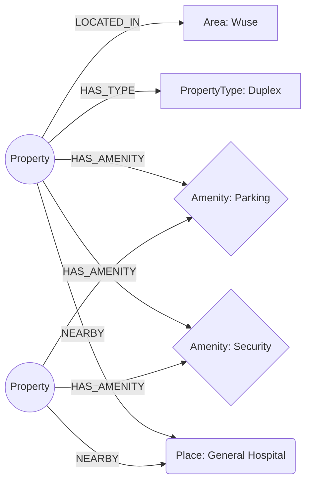

# Aexa-Assessment-Task

# RentalMatch — Graph-Powered Property Matching

A rental property discovery app for the Nigerian market, backed by **CognoDB** (a managed, Neo4j-compatible graph database). Instead of just listing properties, RentalMatch lets users filter by preferences and — more interestingly — explore properties through their *relationships*: shared amenities, shared nearby landmarks, and multi-criteria matching.

---

## Table of contents

- [Why a graph database?](#why-a-graph-database)
- [Data model](#data-model)
- [Features](#features)
- [Tech stack](#tech-stack)
- [Project structure](#project-structure)
- [Setup & run instructions](#setup--run-instructions)
- [Key queries explained](#key-queries-explained)
- [Screenshots](#screenshots)
- [Demo](#demo)

---

## Why a graph database?

Property discovery is fundamentally a **connections** problem, not a rows-and-columns problem:

- **"Find me properties similar to this one"** requires reasoning about shared relationships (amenities in common, nearby landmarks in common) — not a single foreign key lookup.
- **Multi-hop questions** like *"properties within budget, in this area, with this amenity, that are also near a place another matching property is near"* require chained joins in SQL that get unreadable fast. In Cypher, the same question is a short, readable pattern match.
- **Recommendation-style queries** (rank properties by *how many* amenities they share with a given property) are natural graph traversals — `MATCH ... WITH ... WHERE size(...) >= 2` — but in a relational schema they mean a self-join through a junction table, a `GROUP BY`, and a `HAVING`, which is exactly the kind of query the assignment brief calls "awkward in a relational database."
- The domain is naturally a graph: `Property`, `Area`, `Amenity`, `PropertyType`, and `Place` are all entities with meaningful, typed relationships to each other, not just attributes of a single table.

A relational schema *could* model this with junction tables, but the queries that make this app interesting — similarity, shared-neighbor recommendations, multi-hop traversal — are precisely where a graph database's pattern-matching earns its place over SQL joins.

---

## Data model

**Nodes**
| Label | Key properties |
|---|---|
| `Property` | `id`, `name`, `price`, `bedrooms` |
| `Area` | `name` |
| `Amenity` | `name` |
| `PropertyType` | `name` |
| `Place` | `name`, `type` |

**Relationships**
| Relationship | Direction | Meaning |
|---|---|---|
| `(:Property)-[:LOCATED_IN]->(:Area)` | Property → Area | Where the property is |
| `(:Property)-[:HAS_TYPE]->(:PropertyType)` | Property → PropertyType | Apartment, duplex, bungalow, etc. |
| `(:Property)-[:HAS_AMENITY]->(:Amenity)` | Property → Amenity | Parking, Security, Generator, etc. |
| `(:Property)-[:NEARBY]->(:Place)` | Property → Place | Hospitals, schools, and other landmarks close by |



Two properties sharing several `Amenity` or `Place` nodes is what powers the **recommendations** and **similar properties** features — they're discovered by traversal, not by a manual "related items" field.

---

## Features

- **Browse all properties** — full listing with loading skeletons and empty states.
- **Property details** — price (formatted in NGN via `Intl.NumberFormat`), amenities, nearby places, overview.
- **Preference-based matching** (`/match`) — filter by max budget, minimum bedrooms, area, and required amenity via a single parameterised Cypher query.
- **Similar properties** — properties that share `NEARBY` places with a given property (2-hop traversal).
- **Recommendations** — properties ranked by *number of shared amenities* with a given property (multi-hop traversal + aggregation, sorted by match score).

---

## Tech stack

- **Frontend/Backend**: Next.js (App Router), TypeScript, React
- **Styling**: Tailwind CSS
- **Database**: CognoDB (managed graph database, Bolt protocol, Cypher)
- **Driver**: official `neo4j-driver` (Bolt 5.x compatible)

---

## Project structure

```.
├── app/
│   ├── page.tsx                              # Landing page
│   ├── match/
│   │   └── page.tsx                          # Preference-based matching UI
│   ├── properties/
│   │   ├── page.tsx                          # All properties listing
│   │   └── [id]/
│   │       ├── page.tsx                      # Property details
│   │       ├── similar/page.tsx              # Similar properties (shared nearby places)
│   │       └── recommendations/page.tsx      # Recommended properties (shared amenities)
│   └── api/
│       ├── match/route.ts                    # POST — preference-filtered search
│       └── properties/
│           ├── route.ts                      # GET — all properties
│           └── [id]/
│               ├── route.ts                  # GET — single property
│               ├── similar/route.ts          # GET — similar properties
│               └── recommendations/route.ts  # GET — recommended properties
├── components/
│   ├── common/back.tsx                       # BackButton
│   └── properties/propertyCard.tsx           # PropertyCard
├── lib/
│   ├── neo4j.ts                              # Driver setup + runQuery helper
│   └── currencyFomatter.ts                   # NGN currency formatting
├── scripts/
│   └── seed.ts                               # Seeds sample properties/areas/amenities/places
└── README.md
```

---

## Setup & run instructions

### 1. Create your CognoDB instance

1. Sign up at [console.cognodb.com/signup](https://console.cognodb.com/signup) (no credit card required for the free tier).
2. Create a free **c0** instance and pick a region — provisioning takes under a minute.
3. Copy the connection URI (`bolt+s://<instance-id>.databases.cognodb.cloud`) and the generated password for the `cognodb` user. **The password is shown once** — save it immediately.

### 2. Configure environment variables

Create a `.env.local` file in the project root:

```env
NEO4J_URI=bolt+s://<your-instance-id>.databases.cognodb.cloud
NEO4J_USERNAME=cognodb
NEO4J_PASSWORD=<your-generated-password>
```

### 3. Install dependencies

```bash
npm install
```

### 4. Seed the database

```bash
npx tsx scripts/seed.ts
```

This loads sample `Property`, `Area`, `Amenity`, `PropertyType`, and `Place` nodes along with their relationships.

### 5. Run the app

```bash
npm run dev
```

Visit `http://localhost:3000`.

---

## Key queries explained

**1. Preference match (`/api/match`, POST)** — parameterised, single-hop-plus filter across four conditions at once:
```cypher
MATCH (p:Property)-[:LOCATED_IN]->(a:Area)
MATCH (p)-[:HAS_AMENITY]->(am:Amenity)
WHERE p.price <= $budget AND p.bedrooms >= $bedrooms
  AND a.name = $area AND am.name = $amenity
RETURN p.id, p.name, p.price, ...
ORDER BY p.price ASC
```

**2. Recommendations (2-hop traversal + aggregation)** — properties sharing 2+ amenities with a given property, ranked by overlap:
```cypher
MATCH (p:Property {id: $id})-[:HAS_AMENITY]->(am:Amenity)<-[:HAS_AMENITY]-(other:Property)
WHERE other.id <> $id
WITH other, collect(DISTINCT am.name) AS amenities
WHERE size(amenities) >= 2
MATCH (other)-[:LOCATED_IN]->(area:Area)
RETURN other.id, other.name, amenities, size(amenities) AS matchScore
ORDER BY matchScore DESC, other.price ASC
LIMIT 5
```
This is the query a relational database would find awkward: it requires a self-join through a junction table, grouping, and a `HAVING size(...) >= 2` — expressed here as a direct graph pattern.

**3. Similar properties (2-hop traversal via shared landmarks)**:
```cypher
MATCH (p:Property {id: $id})-[:NEARBY]->(place:Place)<-[:NEARBY]-(other:Property)
WHERE other.id <> $id
MATCH (other)-[:LOCATED_IN]->(area:Area)
RETURN DISTINCT other.id, other.name, ...
ORDER BY other.price ASC
LIMIT 5
```

All queries use the parameterised query API (`runQuery(cypher, params)`) via the shared `lib/neo4j.ts` helper — no string-concatenated Cypher anywhere in the codebase.

---

## Screenshots

> _Add screenshots of the landing page, `/properties` listing, property details, `/match`, similar properties, and recommendations pages here._

---

## Demo

- **Hosted demo**: `https://wexa-nine.vercel.app`

